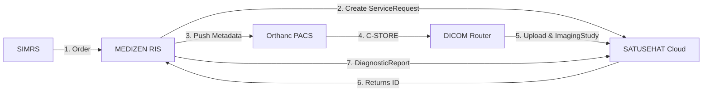

# MEDIZEN RIS
### Smart Radiography & SATUSEHAT Integration Bridge


**MEDIZEN RIS** adalah middleware medis berbasis web yang menghubungkan sistem **SIMRS**, **PACS (Orthanc)**, dan **SATUSEHAT KEMKES**. Aplikasi ini memastikan alur kerja radiologi menjadi otomatis, data terjaga integritasnya, dan hasil bacaan dokter (ekspertise) tersinkronisasi secara real-time ke aplikasi mobile pasien.

---

## ☕ Dukung Pengembangan (Support the Development)

Jika aplikasi ini memberikan manfaat bagi fasyankes Anda dan Anda ingin mendukung pemeliharaan berkelanjutan serta riset fitur interoperabilitas baru, dukung pengembang melalui:

| Metode | Detail Rekening / Akun | Penerima (A.N) |
| :--- | :--- | :--- |
| **BANK BCA** | `6695446563` | **Muhammad Nuryahya** |
| **OVO** | `0857-5228-2522` | **Muhammad Nuryahya** |

---

<div align="center">
  <h2>📺 Video Tutorial Instalasi</h2>
  <p>Tonton panduan langkah demi langkah untuk melakukan instalasi MEDIZEN RIS dari nol.</p>
  <a href="https://youtu.be/fV4B9F4JBqo" target="_blank">
    
  </a>
  <br>
  <p><b><a href="https://youtu.be/fV4B9F4JBqo" target="_blank">Klik di sini untuk menonton di YouTube</a></b></p>
</div>

---

---

## 🏗️ Alur Kerja Sistem (Workflow)



1. **SIMRS** melakukan order pemeriksaan radiologi.
2. **MEDIZEN RIS** membuat resource `ServiceRequest` di SATUSEHAT.
3. **MEDIZEN RIS** mengirim metadata (Worklist) ke **Orthanc** dan melakukan sinkronisasi tag DICOM (Lazy Modify).
4. **Orthanc** mengirim file DICOM ke **DICOM Router** resmi.
5. **DICOM Router** mengunggah file ke SATUSEHAT Cloud.
6. **MEDIZEN RIS** melakukan polling ID gambar dan mengirim **DiagnosticReport** (Ekspertise) yang tertaut dengan gambar tersebut.

---

## 🛠️ Fitur Unggulan

- ✅ **Lazy Modify DICOM:** Melindungi UID asli (SOP/Series UID) agar tidak berubah saat sinkronisasi identitas pasien.
- ✅ **Native Worklist API:** Integrasi Python plugin untuk Orthanc guna mendukung Worklist di modality lama/baru.
- ✅ **Automatic Resource Linking:** Menautkan ID ImagingStudy secara otomatis ke DiagnosticReport agar tombol "Gambar" muncul di aplikasi SATUSEHAT Mobile.
- ✅ **Batch Processing:** Pengiriman data massal (Encounter, Specimen, Observation) dalam satu klik.
- ✅ **Firewall Safeguard:** Script otomatis untuk memperketat akses port PACS proxy.

---

## 💻 Panduan Instalasi Lokal (Windows / Laragon)

### Prasyarat
- PHP 8.1 atau lebih baru
- Composer (v2.0+)
- MySQL 8.0+ atau MariaDB setara
- Node.js & npm (opsional untuk aset frontend)

### Langkah-langkah Detil Instalasi (Laravel)

1. **Clone Repository**
   Buka terminal atau command prompt, arahkan ke direktori server lokal (misal `htdocs` atau `www`), lalu clone:
   ```bash
   git clone https://github.com/username/medizen.git
   cd medizen
   ```

2. **Install Dependensi PHP (Composer)**
   Jika ini adalah instalasi baru, unduh semua library yang dibutuhkan:
   ```bash
   composer install
   ```
   *Note: Jika muncul error "Class not found" saat install, pastikan folder `vendor` belum ada atau hapus folder `vendor` dan `composer.lock` lalu ulangi.*

3. **Penanganan Folder Storage & Bootstrap (PENTING)**
   Jika Anda baru melakukan `git clone`, folder `storage` dan sub-direktorinya seringkali tidak ikut ter-upload. Jalankan perintah berikut untuk memastikan struktur folder tersedia:
   ```bash
   # Masuk ke folder project, lalu buat struktur storage
   mkdir -p storage/app/public
   mkdir -p storage/framework/cache/data
   mkdir -p storage/framework/sessions
   mkdir -p storage/framework/views
   mkdir -p storage/logs
   mkdir -p bootstrap/cache

   # Untuk pengguna Windows (Command Prompt):
   # mkdir storage\app\public
   # mkdir storage\framework\cache\data
   # mkdir storage\framework\sessions
   # mkdir storage\framework\views
   # mkdir storage\logs
   # mkdir bootstrap\cache
   ```

4. **Link Storage**
   Agar file publik (gambar hasil pemeriksaan) dapat diakses, buat link simbolis:
   ```bash
   php artisan storage:link
   ```

5. **Install Dependensi Frontend (NPM) - *Jika diperlukan***
   ```bash
   npm install
   npm run build
   ```

4. **Persiapan Environtment (.env)**
   Salin file konfigurasi contoh menjadi file `.env` aktif:
   ```bash
   cp .env.example .env
   ```
   *(Gunakan `copy .env.example .env` di Command Prompt Windows).*

5. **Generate Application Key**
   Buat kunci enkripsi unik untuk keamanan instalasi lokal Anda:
   ```bash
   php artisan key:generate
   ```

6. **Konfigurasi Database**
   Buat dua database kosong di MySQL/MariaDB bernama `medizen` dan `simrs`. Kemudian buka file `.env` dan sesuaikan koneksi database Anda:
   ```env
   DB_CONNECTION=mysql
   DB_HOST=127.0.0.1
   DB_PORT=3306
   DB_DATABASE=medizen
   DB_USERNAME=root
   DB_PASSWORD=

   # Konfigurasi Database SIMRS (Database pasien/bridging)
   DB_SIMRS_CONNECTION=mysql
   DB_SIMRS_HOST=127.0.0.1
   DB_SIMRS_PORT=3306
   DB_SIMRS_DATABASE=simrs
   DB_SIMRS_USERNAME=root
   DB_SIMRS_PASSWORD=
   ```

7. **Migrasi Database & Data Awal (Seeding)**
   Jalankan perintah ini untuk membangun struktur tabel dan memasukkan data akun demo:
   ```bash
   php artisan migrate --seed
   ```

8. **Konfigurasi SATUSEHAT (di `.env`)**
   Isi dengan kredensial dari DTO Kemenkes agar integrasi berjalan (opsional untuk run awal):
   ```env
   SATUSEHAT_ENV=dev
   SATUSEHAT_CLIENT_ID=client_id_dari_dto
   SATUSEHAT_CLIENT_SECRET=client_secret_dari_dto
   ORGANIZATION_ID=id_rs_organisasi
   ```

9. **Jalankan Aplikasi**
   Hidupkan development server bawaan Laravel:
   ```bash
   php artisan serve
   ```
   Buka browser dan akses: `http://127.0.0.1:8000`

---

## 👥 Akun Demo (Demo Accounts)

Berikut adalah daftar akun dummy yang tersedia setelah melakukan database seeding (`php artisan db:seed`):

**Password Semua Akun:** `password`

| Role | Email / Username |
| --- | --- |
| Super Admin | `superadmin@rsi.com` |
| Admin Radiologi | `admin@rsi.com` |
| Radiografer | `radiografer@rsi.com` |
| Dokter Radiologi | `dokter@rsi.com` |
| Direktur / Manajemen | `direktur@rsi.com` |
| IT Support | `it@rsi.com` |

---

## 🚀 Panduan Instalasi Server (Ubuntu / Production)

### 1. Stack Requirements
- Nginx / Apache
- PHP-FPM 8.2
- Supervisor (Untuk Queue Worker)

### 2. Konfigurasi Nginx
```nginx
server {
    listen 80;
    server_name ris.rumah-sakit.com;
    root /var/www/medizen/public;

    index index.php;
    location / {
        try_files $uri $uri/ /index.php?$query_string;
    }
    
    location ~ \.php$ {
        include snippets/fastcgi-php.conf;
        fastcgi_pass unix:/var/run/php/php8.2-fpm.sock;
    }
}
```

### 3. File Permissions
```bash
sudo chown -R www-data:www-data storage bootstrap/cache
sudo chmod -R 775 storage bootstrap/cache
```

---

## 📡 Integrasi Orthanc & DICOM Router

Agar MEDIZEN RIS dapat berkomunikasi dengan modality dan cloud, lakukan konfigurasi berikut:

### 1. Setup di Orthanc (Configuration.json)
Daftarkan DICOM Router sebagai modality tujuan di dalam file `Configuration.json` Orthanc:
```json
"DicomModalities" : {
    "DCMROUTER" : [ "DCMROUTER", "127.0.0.1", 11112 ]
},
"Plugins" : [ "/path/to/python-plugin.so" ]
```

### 2. Setup di MEDIZEN RIS (.env)
Pastikan keyword modality sama dengan yang ada di Orthanc:
```env
PACS_URL=http://localhost:8042
PACS_USERNAME=admin
PACS_PASSWORD=password
DICOM_ROUTER_MODALITY=DCMROUTER
```

### 3. Setup di DICOM Router (Aplikasi Resmi Kemenkes)
- Atur **Listening Port** ke `11112` (sesuai target Orthanc).
- Masukkan **Organization ID** dan **Client Secret** Anda di aplikasi Router.
- Pastikan folder antrean Router memiliki izin akses baca-tulis.

---

## 🔐 Keamanan & Privasi
- Aplikasi ini menangani data medis sensitif.
- Selalu gunakan **HTTPS** pada server produksi.
- Gunakan fitur **Proxy Auth** jika PACS terekspos ke internet.

## 📄 Lisensi
Didistribusikan di bawah lisensi MIT. Lihat file `LICENSE` untuk detail lebih lanjut.

---

## 🛠️ Troubleshooting (Masalah Umum)
 
- **Error: `No such file or directory` (logs/laravel.log)**
  Penyebab: Folder `storage/logs` belum ada.
  Solusi: Jalankan `mkdir storage/logs`.

- **Error: `The stream or file ".../logs/laravel.log" could not be opened in append mode`**
  Penyebab: Masalah izin akses (permissions).
  Solusi: Jalankan `chmod -R 775 storage bootstrap/cache` atau di Windows pastikan folder tidak *Read-only*.

- **Error: `The implementation of "PUT" is not supported`**
  Penyebab: Biasanya terjadi pada API SATUSEHAT jika ID tidak disertakan. Pastikan modul mapping sudah benar.

- **Folder `vendor` tidak muncul setelah `composer install`**
  Penyebab: Versi PHP tidak sesuai atau ekstensi PHP missing (seperti `zip`, `xml`, `mbstring`).
  Solusi: Periksa `php -m` dan pastikan ekstensi tersebut aktif di `php.ini`.

---

## 👨‍💻 Tentang Pengembang
Aplikasi ini dikembangkan dan dikelola secara mandiri oleh **Muhammad Nuryahya (@arrayazman)**. Fokus utama pengembangan adalah memajukan sistem informasi radiologi di Indonesia agar mampu bersaing secara global dan patuh terhadap regulasi nasional.

Informasi lebih detail mengenai institusi pengembang, versi aplikasi, dan profil teknis dapat dilihat langsung melalui menu **About** di dalam sistem.

*Dikembangkan dengan ❤️ untuk kemajuan interoperabilitas kesehatan di Indonesia.*
